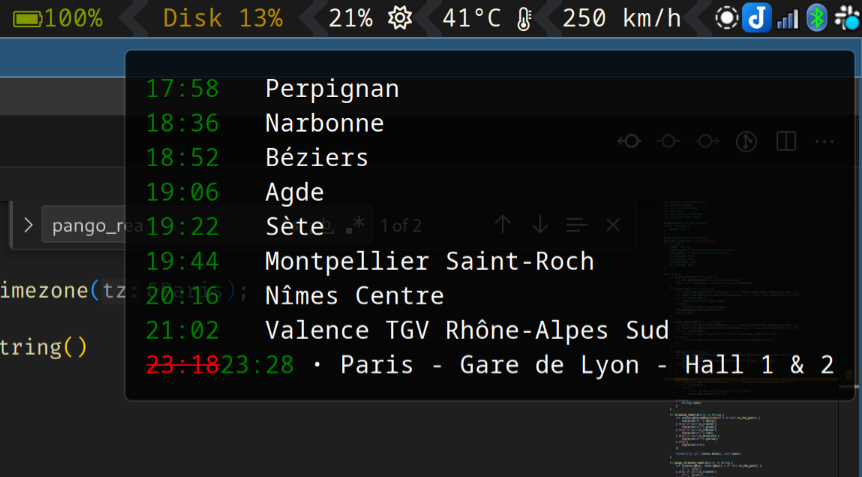

# inouifi

Display information about your train (only inoui TGV): speed and stops (possibily with delay).

This tool can be combined with other tools (in my case with [waybar](https://github.com/Alexays/Waybar)).

It requires to be connected to the train’s wifi.



## Install

You need a rust toolchain. I suggest using [rustup](https://rustup.rs/).

Compile with:

`cargo build --release`

The executable will be in `target/release/inouifi`.

Copy it somewhere in your path (personnaly, I use ~/Apps):

`cp target/release/inouifi ~/Apps`


## Usage

The executable has four commands

`inouifi connected`: display whether you are connected to the train wifi. Returns 0 if connected, 1 otherwise. Use `--quiet` to only have the return code.

`inouifi speed`: display your current speed. Use `--no-unit` if you just want the value in km/h.

`inouifi stops`: all the stops and expected time. It should display real time if your train is delayed, and also added/removed stops (hasn’t been tested — I was lucky on my journey).

`inouifi waybar`: a format suited for waybar. It displays the speed and shows the stops as a tooltip.

Here is way waybar configuration:

```json
"custom/train": {
      "exec-if": "$HOME/Apps/inouifi connected --quiet",
      "exec": "$HOME/Apps/inouifi waybar",
      "interval": 2,
      "format": "{} km/h",
      "return-type": "json"
  }
```

## Thanks

* https://github.com/adhumi/Tchou-Tchou/ for the initial idea
* https://vulpinecitrus.info/blog/the-sncf-wifi-api/ for documenting the api

## Disclaimer

It was coded on one trip and hasn’t be really tested in the wild. Feedback welcome!
